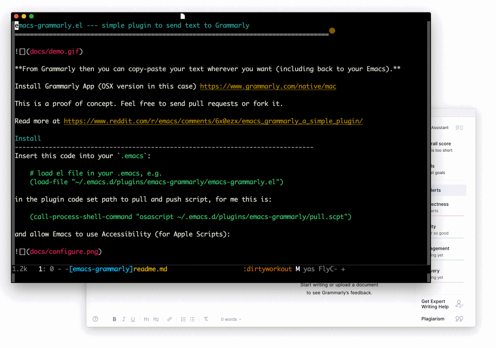

emacs-grammarly.el --- simple plugin to send a text to Grammarly
===================================================================================

**From Grammarly then you can copy-paste your text wherever you want (including back to your Emacs).**

Install Grammarly App (OSX version in this case) https://www.grammarly.com/native/mac 

This is a proof of concept. Feel free to send pull requests or fork it.

Read more at https://www.reddit.com/r/emacs/comments/6x0ezx/emacs_grammarly_a_simple_plugin/ 

Install
-------------------------------------------------------------------------------
Insert this code into your `.emacs`:

    # load el file in your .emacs, e.g. 
    (load-file "~/.emacs.d/plugins/emacs-grammarly/emacs-grammarly.el")

Keybinding
--------------------------------------------------------------------------------

Bind the `grammarly-save-region-and-run` to a key, for instance:

    (global-set-key (kbd "C-c C-g") 'grammarly-save-region-and-run)
    
