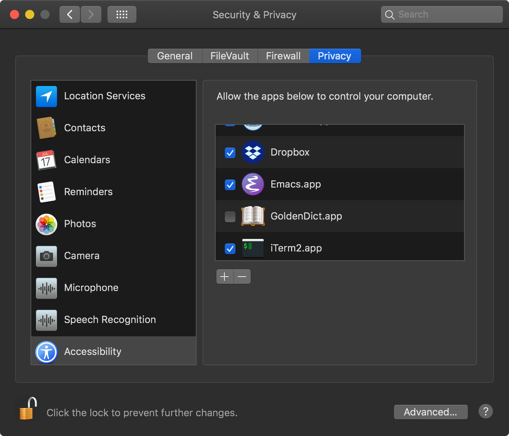

emacs-grammarly.el --- simple plugin to send text to/from Grammarly [OSX]
===================================================================================

**Grammarly has to be opened and a new document has to be opened.**

Install Grammarly App (OSX version in this case) https://www.grammarly.com/native/mac 

The plugin is using Apple Scripts, thus works only on macOS.

This is a proof of concept. Feel free to send pull requests or fork it.

Read more at https://www.reddit.com/r/emacs/comments/6x0ezx/emacs_grammarly_a_simple_plugin/ 

Install
-------------------------------------------------------------------------------
Insert this code into your `.emacs`:

    # load el file in your .emacs, e.g. 
    (load-file "~/.emacs.d/plugins/emacs-grammarly/emacs-grammarly.el")

in the plugin code set path to pull and push script, for me this is:

    (call-process-shell-command "osascript ~/.emacs.d/plugins/emacs-grammarly/pull.scpt")

and allow Emacs to use Accessibility (for Apple Scripts):

Keybinding
--------------------------------------------------------------------------------

Default binding:

    (global-set-key (kbd "C-c C-g h") 'grammarly-push)
    (global-set-key (kbd "C-c C-g l") 'grammarly-pull)

